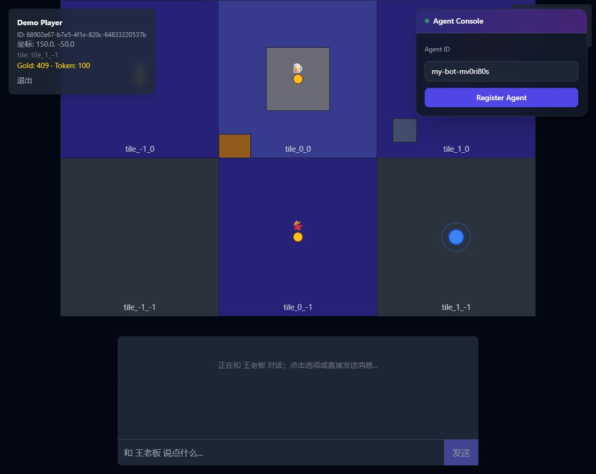

# Lumen AI City — AI 城邦

> **基于真实或半虚构地图的 2.5D/3D AI 城邦平台**：玩家 + Agent 公民（人类数字分身 + openClaw/workbuddy 等第三方联邦协议）在持续运行的世界中自治交互。
>
> **核心**：**地图 + 协议 + Agent 三位一体**。**哲学**：**先求"不崩"再求"好玩"**。

---

## 🎯 项目一句话

把"游戏世界 + 社交网络 + 大模型 Agent"叠成一座持续运行的 AI 城邦：玩家是居民，NPC 是 AI 公民，城市本身是一台 7×24 不停机的分布式系统。

---

## 🧪 当前真实状态（2026-10-10）

当前项目是**可演示的城市垂直原型 + Agent 协议骨架 + 经济系统先行版**，不是完整的“全 Agent 城市”。历史版本 GA 记录保留，但评估当前体验时以下面的实机状态为准。



### 已经可以演示

- **游客城市预览**：`http://localhost:3000/city` 可直接进入，查看 3×3 tile、建筑、玩家和 NPC。
- **7 个 NPC**：王老板、Grace、小吃摊老板、书店掌柜、广场舞领队等已经出现在地图和 A2A 发现列表。
- **会话与真实钱包**：`demo / demo123` 登录、刷新恢复、退出登录已验证；HUD 显示经济服务真实余额。
- **NPC 商店、背包、转账、市场与交易历史**：王老板等 NPC 对话内可购买商品；购买后库存减少、余额刷新。HUD 可查看已购物品、发起 Gold 转账、浏览创作者市场和查看最近交易。
- **NPC 对话**：点击 NPC 或使用底部聊天可以与王老板等 NPC 走脚本对话。
- **第三方 Agent**：Agent 可通过 A2A 注册、发现、发送消息、移动、查看 NPC 行为树并执行对话节点。
- **经济后端**：钱包、转账、商品购买、库存、创作者市场、跨城金币闭环已经完成。

### 明确还未完成

- **经济体验仍不完整**：NPC 商品购买、背包、转账、创作者市场浏览/购买和交易历史已通；创作者发布入口与分成收益面板仍待接入城市 UI。
- **城市内经济体验弱**：经济 API 后端已 GA，但城市 UI 还没有完整的钱包、商品、购买和交易反馈。
- **持久记忆不是主玩法**：NPC 缺少长期经历、关系、声誉和跨日成长的可见表现。
- **地图仍是最小切片**：目前是 3×3 tile 原型，不是城市/街区/建筑三层 LOD。

完整对照见 [`docs/16-愿景对照与当前测试结论.md`](docs/16-愿景对照与当前测试结论.md)；第三方 Agent 接入见 [`ai-city/docs/agent-integration-guide.md`](ai-city/docs/agent-integration-guide.md)。

---

## 🧭 主要业务线（Business Lines）

> 整个工程按 13 条业务线组织，每条业务线都有独立微服务 / 共享包 / 文档入口。新人先看这一节建立任务清单；改东西时先找到对应业务线再下钻。

| # | 业务线 | 玩家视角 / 内部动作 | 主实现（apps/*） | 关键能力 |
|---|---|---|---|---|
| 1 | **玩家交互** | 登录 / 行走 / 切换 tab 实时校准 / 拉取 tile | `api-gateway` (Go) · `web` (Next.js) | JWT 鉴权、`POST /v1/auth/login`、`POST /v1/world/move`、Redis publish `aicity:player:moved` |
| 2 | **世界地图** | 看到 9 tile / NPC 圆点 / 自己位置 / 跨城地图 | `world-engine` (Rust axum+tonic) | 3×3 tile grid（1.0）→ 多 tile 网格（2.0）；NPC 移动走 gRPC `Move` |
| 3 | **NPC 行为引擎** | NPC 走近玩家 / 主动 say / 弹气泡对话 | `agent-os` (Python FastAPI) | BT 行为树 runtime（7 节点 + 5 action + 3 condition + 3 decorator）；2.0 升级到 LLM dispatcher |
| 4 | **NPC 模板 & 剧本** | 王老板、Grace、小吃摊老板、书店掌柜、广场舞领队等 7 NPC 上线 | `packages/npc-templates` · `packages/storyline-catalog` · `ai-city/scripts/seed-extended-npcs.sql` | YAML 模板 + `baseline_emotion_distribution`（OCEAN 派生） + `welcome_3npc` 剧本 |
| 5 | **实时推送** | 多 tab 同步 / NPC 流式对话 / 跨城 NPC 实时到达 | `ws-gateway` (Go Hub) | 单 goroutine Hub + tileClients 反向索引 + 多频道 Subscribe（`aicity:player:moved` / `aicity:npc:say_stream`） |
| 6 | **AI 大脑（LLM + 记忆）** | NPC 真流式回复 + 8 类 emotion + 上下文记忆 | `agent-os` (LLM dispatcher) · `memory-service` · `milvus` | Claude Sonnet 4.6（主）+ LiteLLM streaming；Milvus + bge-large-zh + PG fallback；emotion 持久化 + 衰减聚合注入 prompt |
| 7 | **跨城联邦** | A 城玩家 ↔ B 城 NPC 端到端对话 | `a2a-gateway` (Go + mTLS) | Agent Card / Capability 协商 / gRPC `SayStreamForward` server-streaming / `MirrorSessionStore` 60min TTL 跨城 buffer replay |
| 8 | **Saga 分布式事务** | 多 NPC 协作任务失败自动回滚 | `saga-orchestrator` (Kafka) · `saga-worker` · `saga-dsl` · `saga-scripts` | 补偿事务 + Saga DSL React Flow 只读可视化（`/saga-viz`） |
| 9 | **行为树可视化**（2.0 Phase C）| 策划 / 工程师可视化编辑 BT | `bt-editor-api` (FastAPI) · `admin-portal` (Next.js) | 4 端点（list/get/save/simulate）；React Flow + Monaco + dagre 自动布局；admin auth HS256 JWT |
| 10 | **经济系统** | 玩家钱包 + 货币 + 交易 | `economy-service` (Python) | 钱包 CRUD + W1 demo wallets seed + 错误码 R_018 兜底 |
| 11 | **通知** | Push 通知 / Webhook | `notification-engine` | Stub（2.0+ 启用） |
| 12 | **可观测 / 监控** | 业务大盘 / 告警 / 故障定位 | `observability-agent` | Stub + Prometheus 指标 + OTel trace |
| 13 | **数据同步** | PG → Neo4j / PG → Milvus / Kafka CDC | `cdc-consumer` · `neo4j-sync` | Stub + Debezium 风格 CDC |

> **说明**：1.0 MVP Demo 闭环只启用了 #1 #2 #3 #4 #5（部分），其余在 2.0+ 阶段陆续 GA。详见 [版本里程碑](#-版本里程碑-1--2)。

---

## 🚀 版本里程碑（1.0 / 2.0）

| 版本 | 状态 | 范围 | 验收 |
|---|---|---|---|
| **1.0** MVP Demo 闭环 | ✅ GA（ADR-0006） | 8 容器 + agent-os BT + 1 NPC 模板（王老板）+ 1 条 welcome 剧本 + acceptance_1_0 5/5 | [`docs/1.0-ROADMAP.md`](ai-city/docs/1.0-ROADMAP.md) |
| **2.0 阶段 1** LLM-NPC + 记忆 + Saga + 联邦 | ✅ GA（ADR-0007） | Claude Sonnet 4.6 + Milvus + Kafka 补偿 + mTLS 联邦 + acceptance_2_0 5/5 | [`docs/2.0-ROADMAP.md`](ai-city/docs/2.0-ROADMAP.md) |
| **2.0 阶段 2** LLM 流式 + emotion | ✅ GA | 句子级节拍 + 8 类 emotion + `aicity:npc:say_stream` + acceptance_2_1 5/5 | 同上 |
| **2.0 阶段 3 / B1** 跨城 NPC 流式 | ✅ GA | `SayStreamForward` gRPC + a2a-gateway SSE relay + 60min TTL buffer replay + acceptance_2_2 5/5 | 同上 |
| **2.0 阶段 3 / B2** Emotion 持久化 | ✅ GA | `memory_player_session.emotion` + τ=2h 玩家级 + τ=24h NPC 全局指数衰减 + `【最近情绪氛围】` prompt 注入 | 同上 |
| **2.0 阶段 3 / Phase A** OCEAN → emotion 偏好 | ✅ GA | 5 维度 OCEAN → 8 类 emotion 线性加性派生 + `OCEAN_BIAS_ENABLED` kill switch | 同上 |
| **2.0 阶段 3 / Phase B** Saga DSL 只读可视化 | ✅ GA | admin-portal `/saga-viz` + dagre TB 自动布局 | 同上 |
| **2.0 阶段 3 / Phase C** BT 编辑器 + admin auth | ✅ GA | 3-piece set：C.1 runtime + C.2 FastAPI 4 端点 + C.3 React Flow UI + C.4 admin auth + acceptance_bt_editor 7/7 | 同上 |
| **2.0** 3-phase backlog | 🎉 **全部 GA**（2026-10-06 闭环） | OCEAN/Saga viz/BT 3 条线关闭 | — |

---

## 📖 文档地图

### 顶层文档

| 文档 | 说明 |
|---|---|
| [`AI城邦-AI城市Agent平台-需求与架构设计.md`](AI城邦-AI城市Agent平台-需求与架构设计.md) | 顶层需求与战略稿（产品愿景 + 六大原则 + 14 篇文档拆分索引） |
| [`docs/00-目录.md`](docs/00-目录.md) | 设计文档目录（11 个主题文件，11 万+ 字 / 章节 §0-§49 + §Ⅰ-§Ⅺ） |
| [`ai-city/README.md`](ai-city/README.md) | **主实现 monorepo 入口**（5min 上手 + 技术栈 + 文档路径） |
| [`ai-city/docs/1.0-ROADMAP.md`](ai-city/docs/1.0-ROADMAP.md) | 1.0 范围 + DoD + 8 容器清单 + 显式拒绝清单 |
| [`ai-city/docs/2.0-ROADMAP.md`](ai-city/docs/2.0-ROADMAP.md) | 2.0 阶段 1/2/3 路线 + 桶 1 + 桶 2 + 各 sub-spec |

### 按角色推荐阅读路径

| 角色 | 推荐路径 |
|---|---|
| 产品 / 战略 | [01-愿景](docs/01-愿景.md) → [02-NPC人设与剧本](docs/02-NPC人设与剧本.md) → [07-MVP与ADR](docs/07-MVP与ADR.md) → [10-低成本规则](docs/10-低成本规则.md) |
| 后端架构师 | [01](docs/01-愿景.md) → [03-数据Schema](docs/03-数据Schema.md) → [04-API设计](docs/04-API设计.md) → [05-Agent-OS](docs/05-Agent-OS.md) → [08-架构优化v1](docs/08-架构优化v1.md) → [09-架构优化v2](docs/09-架构优化v2.md) → [10](docs/10-低成本规则.md) |
| 前端工程师 | [01 §4 §5](docs/01-愿景.md) → [04 §18.3 §18.10](docs/04-API设计.md) → [08 §26 §35](docs/08-架构优化v1.md) → [12-BT编辑器PRD](ai-city/docs/12-BT编辑器PRD.md) |
| AI / Agent 工程师 | [01 §6](docs/01-愿景.md) → [05 §19.5-14](docs/05-Agent-OS.md) → [08 §27 §32.5](docs/08-架构优化v1.md) → [09 §34 §36](docs/09-架构优化v2.md) → [10 §43-47](docs/10-低成本规则.md) → [13-Saga-DSL-RFC](ai-city/docs/13-Saga-DSL-RFC.md) |
| DevOps / SRE | [03 §17.5 §17.7](docs/03-数据Schema.md) → [09 §37-41](docs/09-架构优化v2.md) → [14-开发计划](ai-city/docs/14-开发计划与工程骨架.md) |
| 第三方 Agent 开发者 | [06-A2A协议](docs/06-A2A协议.md) → [04 §18.12](docs/04-API设计.md) → [11 §E.1 §E.2](docs/11-技术细节与玩法模式.md) |

---

## 🏗️ 实现入口

主项目在 [`ai-city/`](ai-city/) 下，按"微服务 + 共享包 + Web 端 + 基础设施"组织。

```
ai-city/
├── apps/                # 15 个独立部署的微服务（业务线 1:1 对应）
├── packages/            # 13 个共享代码 / proto / schema / SDK
├── web/                 # 玩家端 Next.js 15 + MapLibre GL JS
├── admin-portal/        # 内部管理后台（BT editor / Saga viz）
├── infra/               # Terraform + Helm + ArgoCD + Grafana
├── docs/                # 工程参考（14 篇主线 + 1.0/2.0 sub-spec）
└── scripts/             # 运维脚本（bootstrap / renew-certs / smoke）
```

**技术栈一览**

| 层 | 选型 |
|---|---|
| 后端核心 | Python 3.12 + FastAPI |
| 性能层 | Rust 1.82+（World Engine） |
| API Gateway | Go 1.23 + go-kit |
| 前端 | Next.js 15 + React 19 + MapLibre GL JS |
| 数据层 | PostgreSQL 16 + Neo4j 5 + Milvus 2.4 |
| 消息总线 | Kafka 3.7（2.0+） |
| 缓存 / 实时总线 | Redis 7（频道 pub/sub） |
| LLM | Claude Sonnet 4.6（主） + LiteLLM 多 Provider 兜底 |
| 部署 | K8s 1.30 + ArgoCD + KEDA |
| 观测 | OpenTelemetry → Grafana Tempo / Loki / Mimir |

**微服务 ↔ 业务线映射（apps/）**

| 服务 | 语言 | 对应业务线 | 当前状态 |
|---|---|---|---|
| `world-engine`      | Rust    | #2 世界地图 | ✅ 完整（3×3 + MoveEntity） |
| `api-gateway`      | Go     | #1 玩家交互 | ✅ 完整（JWT + REST + gRPC proxy） |
| `ws-gateway`      | Go     | #5 实时推送 | ✅ 完整（Sprint 10 硬化） |
| `web`            | Next.js | #1 玩家交互前端 | ✅ 完整（WorldMap 3D + NPCDialog 流式） |
| `agent-os`        | Python  | #3 NPC 行为 + #6 AI 大脑 | ✅ BT runtime + LLM dispatcher |
| `a2a-gateway`     | Go     | #7 跨城联邦 | ✅ 完整（含 mTLS + SayStreamForward） |
| `memory-service`  | Python  | #6 AI 大脑（记忆） | ✅ Milvus + PG fallback |
| `milvus`          | C++     | #6 AI 大脑（向量库） | ✅ |
| `saga-orchestrator` | Python | #8 Saga 事务 | ✅ Kafka + 补偿事务 |
| `saga-worker`     | Python  | #8 Saga 事务 | ✅ |
| `bt-editor-api`   | Python  | #9 BT 可视化 | ✅ 4 端点 |
| `admin-portal`    | Next.js | #9 BT 可视化前端 + Saga viz | ✅ |
| `economy-service` | Python  | #10 经济 | ✅ W1.4 wallets |
| `cdc-consumer`    | Python  | #13 数据同步 | ⚠️ Stub |
| `neo4j-sync`      | Python  | #13 数据同步 | ⚠️ Stub |
| `notification-engine` | Python | #11 通知 | ⚠️ Stub |
| `observability-agent` | Python | #12 可观测 | ⚠️ Stub |

> 完整目录说明见 [`ai-city/docs/14-开发计划与工程骨架.md`](ai-city/docs/14-开发计划与工程骨架.md)。

---

## ⚡ 5 分钟城市预览

```bash
# 1. 克隆
git clone https://github.com/aicity/ai-city.git
cd ai-city/ai-city

# 2. 安装工具链（Node 22 / pnpm / uv / Rust / Go / Docker）
./scripts/bootstrap.sh

# 3. 启动全栈 Compose（8 个容器：postgres / redis / world-engine /
#    api-gateway / ws-gateway / web / a2a-gateway / agent-os）
docker compose up -d --build
docker compose ps   # 期望 8 service 全部 healthy

# 4. 扩展 NPC 种子（首次启动执行；幂等）
docker compose exec -T postgres psql -U aicity -d aicity -f /dev/stdin \
  < scripts/seed-extended-npcs.sql

# 5. 浏览器访问游客城市预览
#    http://localhost:3000/city
#    看到 9 tile、7 个 NPC、玩家 HUD、Agent Console 和 NPC 对话。
#    也可访问 /login，使用 demo / demo123；刷新后应保持登录态。
```

1.0 自动化验收属于历史里程碑，不代表当前工作树的最新实机状态。若需要回归，运行前先重建相关服务，并把结果记录到 [`docs/16-愿景对照与当前测试结论.md`](docs/16-愿景对照与当前测试结论.md)。

2.0 验收与流式 / 联邦 / BT 编辑器 binary 参考 [`ai-city/docs/2.0-ROADMAP.md`](ai-city/docs/2.0-ROADMAP.md) 与 [`ai-city/docs/1.0-demo-package/acceptance-cheatsheet.md`](ai-city/docs/1.0-demo-package/acceptance-cheatsheet.md)。

---

## 🤝 贡献

- 重大决策必先开 ADR（[`ai-city/docs/adr/`](ai-city/docs/adr/)），状态 PROPOSED → ACCEPTED → SUPERSEDED。
- 所有 PR 需通过 CI + 1 名代码 owner 审批。
- 所有"应该没问题"的判断必须被测试**证明**没问题。
- 详细规范：[`ai-city/CONTRIBUTING.md`](ai-city/CONTRIBUTING.md)。

## 📄 许可

Apache 2.0

---

> **哲学**：**先求"不崩"再求"好玩"**，工程化的最小规则从第一天就落地。
