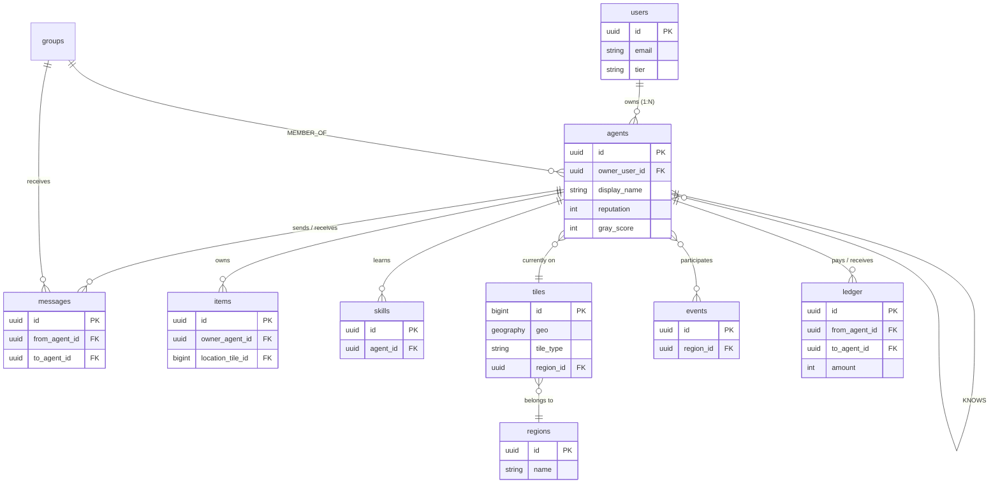

# 数据模型 Schema（详细 DDL）

[← 返回目录](00-目录.md) | [← 02-NPC人设与剧本.md](02-NPC人设与剧本.md)

> 本文档对应原文档 §17：PostgreSQL / Neo4j / Milvus 三库详细 DDL，所有表结构可直接建表使用。

---

## 17. 数据模型 Schema（详细 DDL）

### 17.1 PostgreSQL DDL

```sql
-- 用户表
CREATE TABLE users (
    id              UUID PRIMARY KEY DEFAULT gen_random_uuid(),
    email           VARCHAR(255) UNIQUE NOT NULL,
    display_name    VARCHAR(64) NOT NULL,
    tier            VARCHAR(16) NOT NULL DEFAULT 'free', -- free | pro | enterprise
    created_at      TIMESTAMPTZ DEFAULT NOW(),
    last_login_at   TIMESTAMPTZ,
    metadata        JSONB DEFAULT '{}'::JSONB
);
CREATE INDEX idx_users_email ON users(email);
CREATE INDEX idx_users_tier ON users(tier);

-- Agent 主表
CREATE TABLE agents (
    id                  UUID PRIMARY KEY DEFAULT gen_random_uuid(),
    owner_user_id       UUID REFERENCES users(id) ON DELETE CASCADE,
    npc_template_id     VARCHAR(64),  -- 如果是 NPC，引用模板
    display_name        VARCHAR(64) NOT NULL,
    avatar_url          TEXT,
    voice_id            VARCHAR(64),
    persona             JSONB NOT NULL,  -- 性格、人设、背景
    home_tile_id        BIGINT,
    current_tile_id     BIGINT,
    status              VARCHAR(16) DEFAULT 'active', -- active | sleeping | dead | banned
    is_external         BOOLEAN DEFAULT FALSE,  -- 是否第三方接入
    external_endpoint   TEXT,  -- 第三方 Agent 的回调 URL
    external_auth_token TEXT,  -- 加密存储
    reputation          INTEGER DEFAULT 50,  -- 0-100
    gray_score          INTEGER DEFAULT 0,   -- 灰色值 0-100
    created_at          TIMESTAMPTZ DEFAULT NOW(),
    last_active_at      TIMESTAMPTZ,
    metadata            JSONB DEFAULT '{}'::JSONB
);
CREATE INDEX idx_agents_owner ON agents(owner_user_id);
CREATE INDEX idx_agents_current_tile ON agents(current_tile_id);
CREATE INDEX idx_agents_status ON agents(status);
CREATE INDEX idx_agents_external ON agents(is_external) WHERE is_external = TRUE;

-- 地图分块
CREATE TABLE tiles (
    id              BIGSERIAL PRIMARY KEY,
    geo             GEOGRAPHY(POINT, 4326) NOT NULL,
    tile_type       VARCHAR(32) NOT NULL, -- road | building | park | commercial | residential
    region_id       UUID,
    owner_agent_id  UUID REFERENCES agents(id),
    is_public       BOOLEAN DEFAULT TRUE,
    capacity        INTEGER DEFAULT 0,
    poi_data        JSONB DEFAULT '{}'::JSONB,
    created_at      TIMESTAMPTZ DEFAULT NOW()
);
CREATE INDEX idx_tiles_geo ON tiles USING GIST(geo);
CREATE INDEX idx_tiles_region ON tiles(region_id);
CREATE INDEX idx_tiles_type ON tiles(tile_type);

-- 区域
CREATE TABLE regions (
    id          UUID PRIMARY KEY DEFAULT gen_random_uuid(),
    name        VARCHAR(64) NOT NULL,
    bounds      GEOGRAPHY(POLYGON, 4326) NOT NULL,
    rules       JSONB DEFAULT '{}'::JSONB,
    parent_id   UUID REFERENCES regions(id),
    created_at  TIMESTAMPTZ DEFAULT NOW()
);

-- 消息
CREATE TABLE messages (
    id              UUID PRIMARY KEY DEFAULT gen_random_uuid(),
    from_agent_id   UUID REFERENCES agents(id),
    to_agent_id     UUID REFERENCES agents(id),  -- 单聊；群聊用 group_id
    to_group_id     UUID,
    msg_type        VARCHAR(16) NOT NULL, -- chat | invitation | trade | alert | system
    geo_tag_id      BIGINT REFERENCES tiles(id),
    emotion         JSONB,
    content         TEXT NOT NULL,
    mentions        UUID[] DEFAULT '{}',
    attachments     JSONB DEFAULT '[]'::JSONB,
    created_at      TIMESTAMPTZ DEFAULT NOW()
);
CREATE INDEX idx_messages_from ON messages(from_agent_id, created_at DESC);
CREATE INDEX idx_messages_to ON messages(to_agent_id, created_at DESC);
CREATE INDEX idx_messages_group ON messages(to_group_id, created_at DESC);
CREATE INDEX idx_messages_geo ON messages(geo_tag_id);

-- 物品/资产
CREATE TABLE items (
    id              UUID PRIMARY KEY DEFAULT gen_random_uuid(),
    name            VARCHAR(64) NOT NULL,
    item_type       VARCHAR(32) NOT NULL, -- consumable | equipment | decor | currency
    owner_agent_id  UUID REFERENCES agents(id),
    location_tile_id BIGINT REFERENCES tiles(id),
    quantity        INTEGER DEFAULT 1,
    properties      JSONB DEFAULT '{}'::JSONB,
    created_at      TIMESTAMPTZ DEFAULT NOW()
);
CREATE INDEX idx_items_owner ON items(owner_agent_id);
CREATE INDEX idx_items_location ON items(location_tile_id);

-- 技能
CREATE TABLE skills (
    id              UUID PRIMARY KEY DEFAULT gen_random_uuid(),
    agent_id        UUID REFERENCES agents(id) ON DELETE CASCADE,
    skill_name      VARCHAR(64) NOT NULL,
    level           INTEGER DEFAULT 1,  -- 1-10
    experience      INTEGER DEFAULT 0,
    learned_at      TIMESTAMPTZ DEFAULT NOW(),
    UNIQUE(agent_id, skill_name)
);
CREATE INDEX idx_skills_agent ON skills(agent_id);

-- 事件
CREATE TABLE events (
    id              UUID PRIMARY KEY DEFAULT gen_random_uuid(),
    event_type      VARCHAR(32) NOT NULL,
    payload         JSONB NOT NULL,
    region_id       UUID REFERENCES regions(id),
    start_at        TIMESTAMPTZ NOT NULL,
    end_at          TIMESTAMPTZ,
    status          VARCHAR(16) DEFAULT 'scheduled' -- scheduled | active | ended | cancelled
);
CREATE INDEX idx_events_start ON events(start_at);
CREATE INDEX idx_events_status ON events(status);

-- 交易/账本
CREATE TABLE ledger (
    id              UUID PRIMARY KEY DEFAULT gen_random_uuid(),
    from_agent_id   UUID REFERENCES agents(id),
    to_agent_id     UUID REFERENCES agents(id),
    amount          INTEGER NOT NULL,
    currency        VARCHAR(16) DEFAULT 'credit',
    reason          VARCHAR(128),
    tx_hash         VARCHAR(64),  -- 链上哈希（若启用区块链）
    created_at      TIMESTAMPTZ DEFAULT NOW()
);
CREATE INDEX idx_ledger_from ON ledger(from_agent_id, created_at DESC);
CREATE INDEX idx_ledger_to ON ledger(to_agent_id, created_at DESC);

-- 好感度（冗余在 Neo4j，但保留热数据在 PG）
CREATE TABLE affinity_cache (
    agent_a_id      UUID REFERENCES agents(id),
    agent_b_id      UUID REFERENCES agents(id),
    score           INTEGER DEFAULT 0,  -- 0-100
    relationship_level VARCHAR(16) DEFAULT 'stranger', -- stranger | familiar | friendly | intimate | soulmate
    interaction_count INTEGER DEFAULT 0,
    last_interaction_at TIMESTAMPTZ,
    PRIMARY KEY (agent_a_id, agent_b_id)
);
```

### 17.2 Neo4j 关系图 Schema

```cypher
// 节点
CREATE CONSTRAINT agent_id IF NOT EXISTS FOR (a:Agent) REQUIRE a.id IS UNIQUE;
CREATE CONSTRAINT region_id IF NOT EXISTS FOR (r:Region) REQUIRE r.id IS UNIQUE;
CREATE CONSTRAINT event_id IF NOT EXISTS FOR (e:Event) REQUIRE e.id IS UNIQUE;
CREATE CONSTRAINT item_id IF NOT EXISTS FOR (i:Item) REQUIRE i.id IS UNIQUE;

// 关系
CREATE RELATIONSHIP TYPE KNOWS FROM (a:Agent) TO (b:Agent);
CREATE RELATIONSHIP TYPE FRIEND_OF FROM (a:Agent) TO (b:Agent);
CREATE RELATIONSHIP TYPE FAMILY FROM (a:Agent) TO (b:Agent);
CREATE RELATIONSHIP TYPE ENEMY FROM (a:Agent) TO (b:Agent);
CREATE RELATIONSHIP TYPE WORKS_AT FROM (a:Agent) TO (r:Region);
CREATE RELATIONSHIP TYPE OWNS FROM (a:Agent) TO (i:Item);
CREATE RELATIONSHIP TYPE LIVES_IN FROM (a:Agent) TO (r:Region);
CREATE RELATIONSHIP TYPE MARRIED_TO FROM (a:Agent) TO (b:Agent);
CREATE RELATIONSHIP TYPE PARTICIPATED_IN FROM (a:Agent) TO (e:Event);
CREATE RELATIONSHIP TYPE MEMBER_OF FROM (a:Agent) TO (g:Group);

// 示例
CREATE (alice:Agent {id: '...', name: 'Alice'})-[:FRIEND_OF {score: 75, since: '2026-01-01'}]->(bob:Agent {id: '...', name: 'Bob'});
```

### 17.3 Milvus 向量集合 Schema

```
Collection: agent_memories
- id: VARCHAR(64) (PK)
- agent_id: VARCHAR(64) (indexed)
- content: VARCHAR(2048)
- embedding: FLOAT_VECTOR(1536)
- importance: FLOAT (0-1)
- emotion_vec: FLOAT_VECTOR(6)  // 六维情感
- created_at: INT64
- geo_tag_id: INT64

Collection: city_knowledge
- id: VARCHAR(64) (PK)
- content: VARCHAR(4096)
- embedding: FLOAT_VECTOR(1536)
- source: VARCHAR(64)
- tags: VARCHAR(256)
```

### 17.4 ER 实体关系图（核心 10 表）

> 下面这张图覆盖了最常用的 10 张表的关联关系；其余扩展表按需参考。



### 17.5 索引策略详解

| 查询场景 | 索引类型 | 示例 | 设计理由 |
|---|---|---|---|
| 按 email 查用户 | UNIQUE B-Tree | `users(email)` | 唯一性约束 + 登录查询 O(logN) |
| 按地理位置找附近 tile | GIST | `tiles USING GIST(geo)` | `GEOGRAPHY` 类型必须 GIST |
| 取某 agent 最近消息 | 复合 B-Tree DESC | `messages(from_agent_id, created_at DESC)` | 分页/排序直接吃索引 |
| JSONB 字段条件查询 | GIN jsonb_path_ops | `agents USING GIN (persona jsonb_path_ops)` | 支持 `persona @> '{"ocean":{"openness":0.9}}'` |
| 模糊搜 NPC 名 | GIN trigram | `agents USING GIN (display_name gin_trgm_ops)` | `ILIKE '%老%'` 模糊匹配 |
| 部分索引（仅活跃） | Partial B-Tree | `agents(is_external) WHERE is_external=TRUE` | 第三方 Agent <5%，索引更小 |
| 关系缓存查 | 主键复合 | `affinity_cache(agent_a_id, agent_b_id)` | 双向查找要 `a<b` 规范化 |
| 时序事件 | BRIN | `events USING BRIN (start_at)` | 时间戳顺序写，BRIN 体积小 100 倍 |
| @提及反向查询 | ARRAY GIN | `messages USING GIN (mentions)` | 反查"@提到我的消息" |
| 账本按发起人最近 | 复合 B-Tree DESC | `ledger(from_agent_id, created_at DESC)` | "我的最近交易"主路径 |

**索引红线**：
- ❌ 不要给低基数列（`status`、`gender`）建单独 B-Tree，改用 partial 索引。
- ❌ 不要给 JSONB 整列建 GIN，用 `jsonb_path_ops` 子集。
- ✅ 多列复合索引按"等值在前、范围在后"：`WHERE agent_id=? AND created_at>?`。
- ✅ 单表索引数控制在 **5-7 个以内**，每多一个 INSERT 慢 5-10%。

### 17.6 JSONB 字段规范化

> `agents.persona`、`tiles.poi_data`、`items.properties` 看似自由，其实必须有"约定俗成"的 schema，否则查询性能崩塌。

```sql
-- 方法 1：CHECK 约束强校验（适合核心字段）
ALTER TABLE agents ADD CONSTRAINT chk_persona_shape CHECK (
    persona ? 'ocean' AND
    jsonb_typeof(persona->'ocean') = 'object' AND
    (persona->>'openness')::float BETWEEN 0 AND 1
);

-- 方法 2：COMMENT 软约束（适合变化频繁字段）
COMMENT ON COLUMN agents.persona IS
  'OCEAN 5维 + memory_seed[] + behavior_preferences{}/interaction_hooks[]';
COMMENT ON COLUMN tiles.poi_data IS
  'name, open_hours, services[], thumbnail_url';

-- 方法 3：触发器 + 独立 json_schemas 表（最灵活）
CREATE TABLE json_schemas (
    table_name   TEXT,
    column_name  TEXT,
    schema_json  JSONB,
    PRIMARY KEY (table_name, column_name)
);
```

**常用 JSONB 操作符速查**：

| 操作符 | 含义 | 示例 |
|---|---|---|
| `->`  | 取键（返回 JSON） | `persona->'ocean'` |
| `->>` | 取键（返回 text） | `persona->>'openness'` |
| `@>`  | 包含 | `persona @> '{"ocean":{"openness":0.9}}'::jsonb` |
| `?`   | 含键 | `persona ? 'memory_seed'` |
| `?\|` | 含任一键 | `persona ?\| array['ocean','goal']` |
| `??`  | 缺省 | `persona->'openness' ?? '0.5'::jsonb` |
| `#-`  | 删键 | `UPDATE agents SET persona = persona #- '{ocean,openness}'` |
| `jsonb_path_*` | SQL/JSON 路径 | `jsonb_path_query_array(persona, '$.ocean.*')` |

### 17.7 数据分区策略

> 单表超过 5000 万行就必须考虑分区。下面 3 张表必须分区。

```sql
-- 1. messages 按月分区（最热表）
CREATE TABLE messages (...) PARTITION BY RANGE (created_at);
CREATE TABLE messages_2026_09 PARTITION OF messages
    FOR VALUES FROM ('2026-09-01') TO ('2026-10-01');
-- 自动创建：cron 每月 25 号跑
-- SELECT cron.schedule('create-msg-partition', '0 0 25 * *', $$...$$);

-- 2. ledger 按 from_agent_id HASH 16 区（按用户平均切）
CREATE TABLE ledger (...) PARTITION BY HASH (from_agent_id);
CREATE TABLE ledger_h00 PARTITION OF ledger FOR VALUES WITH (MODULUS 16, REMAINDER 0);
-- ... (REM 0..15 共 16 张)

-- 3. relationship_events 按月分区（保留近 90 天热数据）
CREATE TABLE relationship_events (
    id              BIGSERIAL,
    agent_a_id      UUID,
    agent_b_id      UUID,
    event_type      VARCHAR(16),
    delta           JSONB,
    source_event_id BIGINT,
    created_at      TIMESTAMPTZ DEFAULT NOW()
) PARTITION BY RANGE (created_at);
-- 老分区 DETACH 后归档 S3 冷存储
-- ALTER TABLE relationship_events DETACH PARTITION relationship_events_2026_06;
```

**分区判定阈值**：
- ✅ 日增量 > 1M 行 → 时间分区（RANGE）。
- ✅ 查询按"用户"分布 → HASH 分区。
- ✅ 需要"保留 N 天热数据" → RANGE + DETACH 归档。
- ❌ 表 < 1000 万行 → 不分区（运维复杂度 > 性能收益）。

### 17.8 软删除与归档

```sql
-- 加 deleted_at 列做软删除
ALTER TABLE agents  ADD COLUMN deleted_at  TIMESTAMPTZ;
ALTER TABLE events  ADD COLUMN archived_at TIMESTAMPTZ;

-- 视图过滤软删除（应用层约定全部从视图走）
CREATE VIEW agents_active AS
    SELECT * FROM agents WHERE deleted_at IS NULL;

-- 90 天后硬删除（每天凌晨 3 点）
DELETE FROM agents
WHERE deleted_at < NOW() - INTERVAL '90 days';
-- 配套审计：硬删除前写 audit_log
INSERT INTO audit_log (op, target_id, payload, op_at)
VALUES ('hard_delete_agent', OLD.id, to_jsonb(OLD), NOW());
```

**软 vs 硬选用原则**：

| 表类型 | 推荐方式 | 理由 |
|---|---|---|
| users / agents 主体 | 软删 | 误删可恢复，玩家资产不能丢 |
| messages / notifications | 硬删 | 量大、价值低 |
| ledger / 账本 | **永不删** | 合规要求（反洗钱） |
| events / 节日记录 | 90 天软→硬 | 复盘后归档 |

### 17.9 字段命名与编码规范

| 类别 | 命名 | 示例 | 反例 |
|---|---|---|---|
| 主键 | `id` | `agents.id` | `agent_uuid`（冗余） |
| 外键 | `<table>_id` | `messages.from_agent_id` | `from` |
| 时间戳 | `<verb>_at` | `created_at`、`deleted_at` | `created_time` |
| 布尔 | `is_`/`has_`/`can_` | `is_external`、`has_voice` | `external` |
| 枚举 | VARCHAR + CHECK | `status VARCHAR(16) CHECK (status IN (...))` | ENUM 类型（迁移痛） |
| 数值范围 | 注释 | `reputation INTEGER -- 0-100` | 默认 INT 啥都不写 |
| JSONB 键 | snake_case | `ocean.openness` | `ocean.opennessScore` |
| 索引 | `idx_<table>_<col>` | `idx_agents_external` | `agents_idx1` |

**类型选择红线**：
- ✅ 时间一律 `TIMESTAMPTZ`（无 timezone 必踩坑）。
- ✅ IP 用 `INET`，URL 用 `TEXT`（不是 VARCHAR(255)）。
- ✅ 钱用 `BIGINT` 存"分"，不用 `MONEY`。
- ❌ 浮点存钱（精度丢）。

### 17.10 Neo4j 节点与关系的完整属性

```cypher
// ===== Agent 节点 =====
(:Agent {
    id:              'uuid-string',         // PK
    display_name:    '老李',
    npc_template_id: 'npc_lao_li',         // 来源模板
    reputation:      75,                    // 0-100
    gray_score:      12,                    // 0-100
    last_active_at:  datetime(),            // 索引
    status:          'active'               // active | sleeping | dead | banned
})

// ===== Region / Item / Event / Group 节点 =====
(:Region {
    id: 'uuid', name: 'CBD 中心',
    bounds_wkt: 'POLYGON(...)', population: 12450
})
(:Item {
    id: 'uuid', name: '独角兽贴纸',
    item_type: 'decor',
    rarity: 'legendary'        // common | rare | epic | legendary
})
(:Event {
    id: 'uuid', name: '元旦灯会',
    event_type: 'festival',
    start_at: datetime(), end_at: datetime()
})
(:Group {
    id: 'uuid', name: '夜读会',
    topic: 'philosophy'
})

// ===== 关系类型与属性 =====

(a:Agent)-[:KNOWS {
    since: date(),
    interaction_count: 24,
    source: 'direct'                 // direct | reported | inferred
}]->(b:Agent)

(a:Agent)-[:FRIEND_OF {
    intimacy:        75,             // 0-100
    trust:           80,             // 0-100
    familiarity:     60,             // 0-100
    last_interaction_at: datetime()
}]->(b:Agent)

(a:Agent)-[:ENEMY {
    hostility: 90,                   // 0-100
    since:     date(),
    reason:    'Q 黑产纠纷'
}]->(b:Agent)

(a:Agent)-[:MARRIED_TO {
    since:  date(),
    status: 'married'                // married | divorced | widowed
}]->(b:Agent)

(a:Agent)-[:MEMBER_OF {
    joined_at: datetime(),
    role:      'admin'               // admin | member | guest
}]->(g:Group)

(a:Agent)-[:WORKS_AT {
    since:    date(),
    position: 'barista'
}]->(r:Region)

(a:Agent)-[:OWNS {
    quantity:     1,
    acquired_at:  datetime()
}]->(i:Item)

(a:Agent)-[:PARTICIPATED_IN {
    role:     'organizer',           // organizer | participant | spectator
    score:    85
}]->(e:Event)
```

**Neo4j 设计要点**：
- ✅ 关系上挂属性（intimacy、trust）更灵活，比挂节点好。
- ✅ 常用条件必须建索引：`CREATE INDEX rel_intimacy IF NOT EXISTS FOR ()-[r:FRIEND_OF]-() ON (r.intimacy)`。
- ❌ 不要把所有数据塞进 Neo4j——**PG 是真相源**，Neo4j 只是关系投影。

### 17.11 Milvus 索引参数详解

```
Collection: agent_memories
- id:           VARCHAR(64)   PK
- agent_id:     VARCHAR(64)            ← 标量字段，过滤用
- content:      VARCHAR(2048)
- embedding:    FLOAT_VECTOR(1536)    ← 向量字段
- emotion_vec:  FLOAT_VECTOR(6)       ← 6 维情感向量
- importance:   FLOAT                 ← 0-1
- created_at:   INT64                 ← 毫秒时间戳
- geo_tag_id:   INT64

向量索引：
{
    "index_type":   "HNSW",
    "metric_type":  "COSINE",
    "params": {
        "M":              16,         // 每节点连接数（越大越准越慢）
        "efConstruction": 200          // 构建时搜索深度
    }
}
搜索参数：
{
    "params": { "ef": 64 }             // 搜索深度（recall/速度旋钮）
}

Collection: city_knowledge
- embedding: FLOAT_VECTOR(1536)
索引：
{
    "index_type":   "IVF_SQ8",         // 量化压缩，省内存 4 倍
    "metric_type":  "IP",              // 内积
    "params": { "nlist": 1024 }        // 聚类数（≈ sqrt(N)）
}
搜索：
{ "params": { "nprobe": 32 } }
```

**HNSW vs IVF 选用矩阵**：

| 规模 | 召回要求 | 推荐 | 内存 |
|---|---|---|---|
| < 100 万向量 | 极高 (95%+) | HNSW M=16 | ×1 |
| 100 万-1 亿 | 高 | HNSW + PQ | ×0.25 |
| 1 亿-10 亿 | 中（90%） | IVF_SQ8 | ×0.25 |
| > 10 亿 | 中 | IVF_PQ + DiskANN | ×0.1 |

**搜索 QPS 旋钮**：
- QPS < 100 → HNSW ef=64（准）。
- QPS 100-1000 → HNSW ef=32 或 IVF nprobe=32。
- QPS > 1000 → IVF + GPU。

### 17.12 三库联合查询模式

> 4 种典型查询模式，每种对应不同的库组合策略。

```sql
-- 模式 1：纯关系查询（Neo4j 主场）
MATCH (a:Agent {id:$aid})-[:FRIEND_OF*1..3]->(b:Agent)
WHERE b.reputation > 60
RETURN b.id, b.display_name, count(*) AS hop
ORDER BY hop LIMIT 50;

-- 模式 2：纯事务（PostgreSQL 主场）
SELECT id, display_name, reputation
FROM agents
WHERE current_tile_id = $1 AND status = 'active'
ORDER BY reputation DESC LIMIT 20;
-- 走 idx_agents_current_tile

-- 模式 3：向量检索（Milvus 主场）
search_params = {"ef": 64}
results = collection.search(
    expr='agent_id == "$aid" and importance > 0.6',
    data=[query_embedding],
    limit=10,
    output_fields=['id', 'content', 'created_at']
)

-- 模式 4：混合（PG 主从筛选 → Milvus 精排 → Neo4j 关系扩展）
-- step1 PG：选出最近 30 天活跃 agent（裁剪到 ~1000）
ids = SELECT id FROM agents
      WHERE last_active_at > NOW() - INTERVAL '30 days'
      LIMIT 1000;

-- step2 Milvus：在候选中检索相关记忆
recall = milvus.search(
    filter=f"agent_id in {ids}",
    data=[emb],
    limit=20
);

-- step3 Neo4j：把召回结果做社交扩展
graph = neo4j.run("""
    UNWIND $ids AS aid
    MATCH (a:Agent {id:aid})-[:FRIEND_OF]-(b:Agent)
    RETURN a.id, b.id, b.display_name, intimacy
""", ids=[r['id'] for r in recall]);
```

**组合查询的总延迟预算**（P95 < 200ms）：
| 步骤 | 预算 |
|---|---|
| PG 主筛选 | 20ms |
| Milvus 精排 | 80ms |
| Neo4j 扩展 | 60ms |
| 序列化 + 网络 | 40ms |

### 17.13 种子数据示例

```sql
-- 启动时插入 10 个样板 NPC（与 §15.2 一一对应）
INSERT INTO agents (id, npc_template_id, display_name, persona, home_tile_id, current_tile_id) VALUES
('11111111-1111-1111-1111-111111111111', 'npc_lao_li', '老李',
 '{"ocean":{"openness":0.6,"conscientiousness":0.8,"extraversion":0.5,"agreeableness":0.9,"neuroticism":0.2},
   "memory_seed":["老伴已故5年","晨光咖啡创始人","每天5点起床"]}'::jsonb,
 100001, 100002),
('22222222-2222-2222-2222-222222222222', 'npc_ayi', '阿忆',
 '{"ocean":{"openness":0.9,"conscientiousness":0.4,"extraversion":0.3,"agreeableness":0.5,"neuroticism":0.7}}'::jsonb,
 100003, 100003),
-- ... (共 10 行)
('00000000-0000-0000-0000-0000000000aa', 'npc_mayor', '林市长', '{}'::jsonb, 100010, 100010);

-- 一次性插 10 行；写在 migration 文件里
```

```cypher
-- 同步初始化 Neo4j 关系图（示例：老李在晨光咖啡工作）
MERGE (laoli:Agent {id: '11111111-1111-1111-1111-111111111111'})
  SET laoli.display_name = '老李';
MERGE (shop:Region {id: 'r_coffee_shop'})
  SET shop.name = '晨光咖啡';
MERGE (laoli)-[:WORKS_AT {since: date('2015-03-01'), position: 'owner'}]->(shop);

-- 老李 ↔ 钟警官是熟人
MERGE (zhong:Agent {id: '33333333-3333-3333-3333-333333333333'});
MERGE (laoli)-[:KNOWS {since: date('2020-05-01'), interaction_count: 42}]->(zhong);
```

### 17.14 性能基准（参考值）

| 表 | 规模 | 查询模式 | P95 目标 | 实测建议 |
|---|---|---|---|---|
| users | 100 万 | by email | < 5ms | 2ms（UNIQUE B-Tree） |
| agents | 100 万 | by (tile, status) | < 10ms | 6ms（复合索引） |
| messages | 10 亿 | 分页最近 20 条 | < 20ms | 15ms（分区裁剪） |
| tiles GIST 5km | 50 万 | 半径查询 | < 30ms | 22ms |
| affinity_cache | 1 亿 | by (a,b) | < 5ms | 3ms（PK 命中） |
| ledger | 5 亿 | by (from, time) | < 15ms | 10ms（HASH+时间排序） |
| Neo4j 3-hop | 10 万节点 | 社交扩展 | < 80ms | 60ms |
| Milvus 10-NN | 1 亿向量 | HNSW ef=64 | < 50ms | 35ms |
| 三库联合模式 4 | — | 端到端 | < 200ms | 150ms |

**压测要点**：
- 数据量按"1 个月后预估"，不按 MVP。
- 每次 schema 变更必须重测对应查询。
- 索引"红蓝对比"：DROP/ADD 后查询计划必须 EXPLAIN ANALYZE 看过。
- 用 `pgbench` / `k6` / `vegeta` 三件套覆盖 PG / HTTP / WS。

### 17.15 Schema 演进与版本管理

**3 条铁律**：

1. **永远向后兼容**
   - ✅ 加列：`ALTER TABLE agents ADD COLUMN avatar_url TEXT DEFAULT '/default.png';`
   - ✅ 加索引：`CREATE INDEX CONCURRENTLY ...`（不锁表）。
   - ✅ 加表：新表随意。
   - ❌ 删列 / 改类型 / 改约束 → 必须走"双写 → 切流 → 清理"。

2. **破坏性变更走三步**：
   ```
   step1 双写：新旧字段同时写（双写 N 天）
   step2 切流：读新字段，旧字段降级为日志
   step3 清理：删旧字段（一般在 2-3 个版本后）
   ```
   例：把 `affinity_cache.score INT` → `affinity_cache.scores JSONB`
   ```
   -- step1：加 scores 列 + 触发器双写
   ALTER TABLE affinity_cache ADD COLUMN scores JSONB;
   CREATE TRIGGER trg_double_write AFTER INSERT OR UPDATE ON affinity_cache
       FOR EACH ROW EXECUTE FUNCTION sync_scores();

   -- step2：应用代码切到读 scores
   -- step3：几个月后 DROP COLUMN score
   ```

3. **每次 schema 变更进 git 一条 migration**：
   ```
   migrations/
   ├── 0001_initial.sql
   ├── 0002_add_avatar_url.sql
   ├── 0003_drop_unused_idx.sql
   ├── 0004_split_messages_partition.sql
   └── 0005_double_write_scores.sql
   ```
   使用 `golang-migrate` / `flyway` / `prisma migrate`。

**反模式**：
- ❌ 直接 `ALTER TABLE` 不写 migration 文件。
- ❌ 应用代码自动改 schema（必须用 DBA 工具）。
- ❌ 一个 migration 改 10 张表（拆开）。
- ❌ `DROP COLUMN` 不做备份（先 `ALTER ... RENAME TO ..._bak` 留 N 周）。

---

## 附：第三部分新增的 Schema（§25）

> 在第三部分"图数据库异步化重构"中，我们扩充了关系存储结构（详见 [08-架构优化v1.md](08-架构优化v1.md)）：

```sql
-- 关系主表（高频读写，PG JSONB 灵活扩展）
CREATE TABLE relationships (
    agent_a_id       UUID NOT NULL,
    agent_b_id       UUID NOT NULL,
    rel_type         VARCHAR(16) NOT NULL,  -- friend | family | enemy | lover | colleague | neutral
    scores           JSONB NOT NULL DEFAULT '{}',  -- {"intimacy": 75, "trust": 80, "familiarity": 60, "last_meeting_days": 3}
    interaction_count INTEGER DEFAULT 0,
    last_interaction_at TIMESTAMPTZ,
    first_met_at     TIMESTAMPTZ,
    history          JSONB DEFAULT '[]'::JSONB,
    source           VARCHAR(16) DEFAULT 'direct',  -- direct | reported | inferred
    trust_level      FLOAT DEFAULT 1.0,  -- 0-1
    created_at       TIMESTAMPTZ DEFAULT NOW(),
    updated_at       TIMESTAMPTZ DEFAULT NOW(),
    PRIMARY KEY (agent_a_id, agent_b_id),
    CHECK (agent_a_id < agent_b_id)
);

-- 关系变更事件（CDC 来源）
CREATE TABLE relationship_events (
    id               BIGSERIAL PRIMARY KEY,
    agent_a_id       UUID,
    agent_b_id       UUID,
    event_type       VARCHAR(16) NOT NULL,
    delta            JSONB NOT NULL,
    source_event_id  BIGINT,
    created_at       TIMESTAMPTZ DEFAULT NOW()
);
```

## 附：第五部分新增的 Schema（§45）

> 在第五部分"记忆检索不精准"中，我们推荐极简字段（详见 [10-低成本规则.md](10-低成本规则.md)）：

```sql
-- 极简记忆表（替换或并存于原有 memories 表）
CREATE TABLE agent_memories_simple (
    id              BIGSERIAL PRIMARY KEY,
    agent_id        UUID NOT NULL,
    content         TEXT NOT NULL,
    importance      SMALLINT NOT NULL DEFAULT 1,  -- 1-5
    created_at      TIMESTAMPTZ DEFAULT NOW()
);
CREATE INDEX idx_mem_simple_agent_created  ON agent_memories_simple(agent_id, created_at DESC);
CREATE INDEX idx_mem_simple_agent_import   ON agent_memories_simple(agent_id, importance DESC);
```

---

[← 返回目录](00-目录.md) | [← 02-NPC人设与剧本.md](02-NPC人设与剧本.md) | [继续阅读：04-API设计.md →](04-API设计.md)